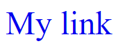
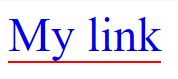

# Underline Color

Estilize um link para quando o usuário passar com o mouse em cima adicione um underline com uma cor diferente da usada para o texto do link.

## Exemplo

Veja os exemplos abaixo como referência:

### Link normal

### Link com efeito

